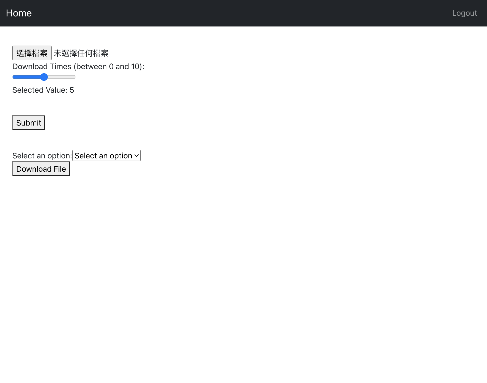

# upload-and-download-file

## Description
Provide a service that can upload files and share files.
* Create a front-end so that users can upload files and get the sharing URL to share with others for downloading.
* Create a front-end API that can receive calls from the front-end, upload files to the back-end, and use postgres db to store file information
 
## Purpose
Different from the public file sharing function, provide a service that can provide organizations with secure uploading and sharing.

## Installation
```bash
$ npm install
```

* Clone the project:

```bash
$ git clone https://github.com/tsornghaw/upload-and-download-file.git
# Move to the directory where main.go exists [WORKDIR paths should be absolute]
$ cd Server
# Install any required modules
$ go mod tidy
# Run the Go build and output binary under VIDEO-CALL-SERVER
$ go build .
```

**NOTE: go mod tidy** is used to maintain and tidy up the project's dependencies.
**NOTE: go build .** is used to compile and build the Go package in the current directory.

* Customize `config.toml` for your scenario
**NOTE:** Viper will read a config string retrieved from a path in a Key/Value store. These values take precedence over default values, but are overridden by configuration values retrieved from environment variables.

## Backend Server
### Project Setup
We use golang gin framework for building the backend.
### Database Configuration
We establishe a connection to a postgresql database using GORM, a popular ORM for Go.
### User Registration
User data is sent via a POST request, hashed passwords are stored in the database, and a JWT token is generated and sent back as a cookie.
* User Login: A user login endpoint is created, which checks the user's email and password, returns a JWT token as a cookie upon successful login, and handles errors for incorrect credentials.
* Authenticated User: We implements an endpoint to retrieve the currently authenticated user's details. It verifies the JWT token from the cookie, retrieves the user's data from the database, and returns it.
* User Logout: A logout endpoint is created to remove the JWT token cookie, effectively logging the user out.

## Frontend Server
* Use Bootstrap to the project for styling. We add a sign-in form template from Bootstrap to App.tsx. This form includes fields for email and password.
### Register, Login, Logout
Create a navigation menu for easy page navigation. We'll include links for 'Home,' 'Login,' and 'Register.'
* Register page

* Login page

* Home page

1. We create a form with fields for name, email, and password. When a user submits the registration form, we'll send a POST request to the server. If the registration is successful, we'll redirect the user to the login page.
* For user login, we'll create input fields for email and password and send another POST request to the server. To manage user authentication, we'll use cookies obtained from the server's response.
* The 'Home' component will display the authenticated user's name by fetching user data using useEffect.
* We create a logout button that sends a POST request to clear cookies and log the user out. The displayed name will update accordingly.

### Upload and Download
* Upload

* Download

1. Provide an upload block. If the upload is successful, there will be a display network.
2. For uploaded files, you can choose a limit on the number of times (1 to 10 times)

### Administrator
* Admin

1. Provide a screen where you can browse the file information list, delete files, and add files
2. The file must have information such as upload time, sharing time, number of shares, file size, file name, file type, etc.